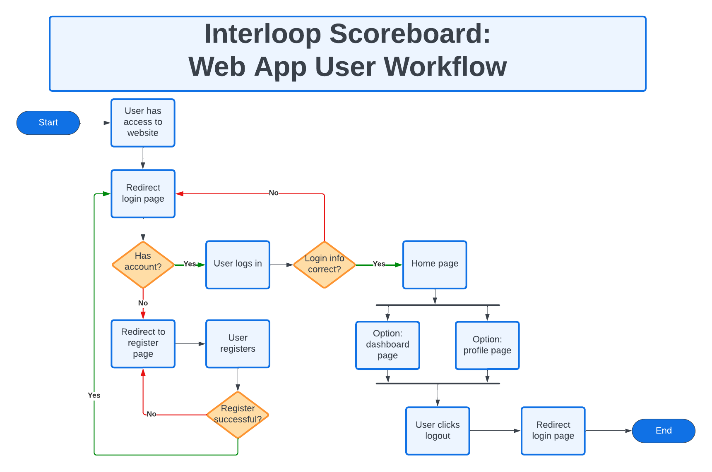

# Capstone Project: Interloop Dashboard


## Table of Contents:
1. [Overview](#overview)
2. [How to Use](#howto)
3. [System Design](#sysdesign)
    1. [Register Page](#reg)
    2. [Login Page](#log)
    3. [Home Page](#home)
    4. [Dashboard Pages](#dash)
4. [System Architecture](#sysarch)
4. [Requirements](#req)
    1. [Functional Requirements](#funcreq)
    2. [Non-functional Requirements](#nonfunreq)
    3. [User Workflow](#userflow)
    4. [Authentication](#auth)
    5. [Embedded Dashboard](#embdash)
5. [Conclusion](#conclusion)

## Overview <a name="overview"></a>
- Client: Interloop.AI
- Develop a web application that displays an embedded Dashboard for both company data and individual employee data

## How to Use <a name="howto"></a>
- This Web Application requires a verfied @interloop.ai email address
- To run a mock website:

First, run the development server:

```bash
npm run dev
# or
yarn dev
# or
pnpm dev
```
Open [http://localhost:3000](http://localhost:3000) with your browser to see the result.

## System Design <a name="sysdesign"></a>
This section describes the user interface of this system. Each page is shown and specific features and functionality are listed.

### Login Page (In Progress) <a name="log"></a>
Input boxes will display a message if any credentials are incorrect, i.e. email or password is incorrect or user does not exist. Users are encouraged to sign up if they do not have an account yet.


### Register Page(In Progress) <a name="reg"></a>

Input boxes display a message when input is incorrect, giving the user adequate opportunities to fill out the form correctly. User is notified if registration was successful or not.

### Home Page (In Progress) <a name="home"></a>


This is the landing page after logging in. Main features include two widgets that are also redirects to other pages. Top widget is the individuals 


### Dashboard Pages(In Progress) <a name="dash"></a>


## System Architecture <a name="sysarch"></a>
The second paragraph text

## Requirements <a name="req"></a>
The second paragraph text

### Functional Requirements <a name="funcreq"></a>
This is a sub paragraph, formatted in heading 3 style

### Non-functional Requirements <a name="nonfunreq"></a>
This is a sub paragraph, formatted in heading 3 style

### User Workflow <a name="userflow"></a>


### Authentication <a name="auth"></a>
This is a sub paragraph, formatted in heading 3 style

### Embedded Dashboard <a name="embdash"></a>
This is a sub paragraph, formatted in heading 3 style

## Conclusion <a name="conclusion"></a>
The second paragraph text
